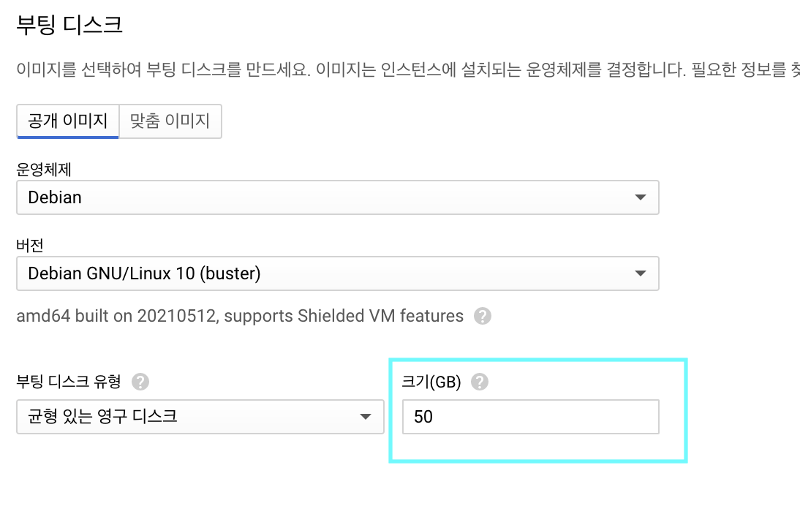

# 구글 클라우드 플랫폼에 배포하기

### **자원을 효율적으로 이용하기 위해서는 유휴 터미널을 사용하여 Meson 프로젝트를 배포하는 것이 좋습니다.**

### **그래도, GCP를 이용하고자 하신다면, 아래의 지침을 따라주세요. Meson을 채굴하는 동시 GCP에 회원가입하고, 프로젝트를 생성하여 프로젝트를 시작할 수 있습니다.**

## Step1, 회원 가입

구글 클라우드 플랫폼 \(GCP\) 웹사이트에 방문합니다. [https://cloud.google.com/](https://cloud.google.com/)


지침을 따라 전화번호와 신용카드 \(마스터카드 혹은 Visa\) 를 입력하면 90일동안 사용할 수 있는 $300의 시험 크레딧을 얻게 됩니다.

## Step2, 인스턴스 템플릿 생성

1. 탐색 메뉴 열기 -&gt; "Compute Engine" 클릭 -&gt; "인스턴스 템플릿" 클릭


1. 인스턴스 템플릿 만들기


1. 디스크의 용량을 최소 50 GB로 변경


"변경" 버튼을 눌러 디스크의 용량을 50 GB 이상으로 늘려주세요. 서비스를 실행하기 위해서는 40 GB 이상의 용량이 필요합니다.



1. Meson 네트워크에서 사용할 포트를 열기 위해서 네트워크 태그 "meson" 을 추가합니다.


## Step3, 방금 추가한 네트워크 태그 "meson" 을 설정합니다.


상단의 스크린샷을 참고하여 TCP 연결에 대해 19091 포트를 열도록 설정합니다.

## Step4, meson-template 인스턴스 템플릿으로부터 VM 인스턴스 생성하기


위에서 이미 인스턴스 템플릿을 만들었기 때문에, 단순히 "만들기" 버튼만 클릭하면 됩니다.


## Step5, 배포를 마무리하기 위해 SSH를 클릭하여 서버에 연결하세요


당신의 서버를 Meson 터미널로 배포하기 위해 아래 링크의 지침을 따라하세요.

“[https://meson.network/terminals](https://meson.network/terminals)”

```text
####### 튜토리얼: 리눅스 서버에서 채굴자 터미널을 설치하고 구동하기 #######
당신이 사용하는 포트가 방화벽에서 열려있어야 하며, "sudo" 권한이 사용 가능해야 합니다.

# Step.1 터미널 패키지 다운로드
$ wget 'https://assets.meson.network:10443/static/terminal/v2.5.1/meson-linux-amd64.tar.gz'
# Step.2 패키지 압축풀기
$ tar -zxf meson-linux-amd64.tar.gz
# Step.3 App을 서비스로 등록
$ cd ./meson-linux-amd64
$ sudo ./meson service-install
# Step.4 토큰, 사용할 포트, 제공할 용량 입력
# Step.5 App 구동
$ sudo ./meson service-start
# Step.6 1분 정도 대기하여 상태를 체크
$ sudo ./meson service-status
약 2-3분 후 새로운 터미널 레코드를 생성하게 됩니다.
# Step.7 채굴 수익 확인
### 다른 명령어들 ###
app 구동 정지: "sudo ./meson service-stop"
app 삭제: "sudo ./meson service-remove"

( 이것은 현재 (2021/05/27) 리눅스 64비트 서버 기준으로 작성되었습니다. )
```

그리고 현재 배포한 서버가 Meson Note로 작동되고 있음을 확인할 수 있습니다.


여기까지 도달하셨다면 축하드립니다!

## 다른 질문이 있나요?

웹사이트: [https://meson.network/](https://meson.network/)

디스코드: [https://discord.com/invite/z6YfSHDkmS](https://discord.com/invite/z6YfSHDkmS)

텔레그램: [https://t.me/mesonnetwork](https://t.me/mesonnetwork)

## 무료 체험 이후 요금이 발생할 수도 있으니 유의바랍니다.

[https://cloud.google.com/vpc/network-pricing](https://cloud.google.com/vpc/network-pricing)


